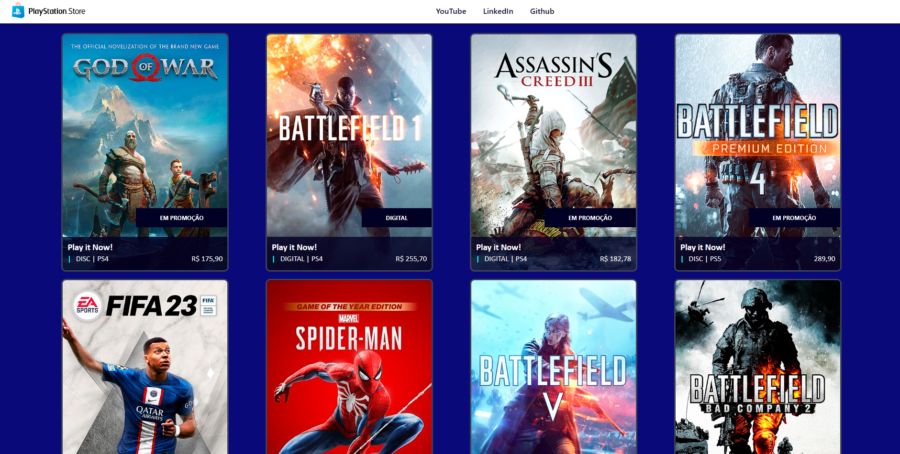

<h1 align="center">Playstation Store - Clone</h1>

	Clone da loja virtual de jogos da playstation store através da formação em Angular da
	<a href="https://www.dio.me/" target="_blank">DIO</a> com aulas e ministradas pelo 
	<a href="https://github.com/felipeAguiarCode" target="_blank">Felipe Aguiar</a> 
 

 

  
   

## 🚀 Tecnologias

Esse projeto foi desenvolvido com as seguintes tecnologias:

- HTML
- Saas (scss)
- TypeScript
- Git e Github
- Angular

## 🗺️ Roadmap

O projeto é a aplicação prática do conteúdo ministrado durante a formação de Agular na DIO.

- Escolha da referencia para o start do front-end
- Análise estrutural e criação dos componentes e subcomponentes.
- Estilização dos dos componentes e subcomponentes.
- Adição dos assets: Imagens

Feito com ♥ by Nelson Soares